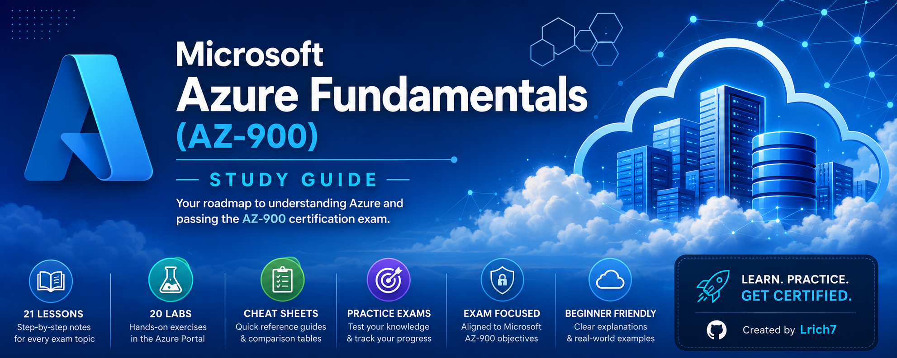

# Microsoft Azure Fundamentals (AZ-900)




---

# 👋 Welcome!

Welcome to the **Microsoft Azure Fundamentals (AZ-900) Study Guide**.

Whether you're brand new to Azure or preparing for the AZ-900 certification exam, this repository is designed to take you from the fundamentals all the way to exam readiness.

This is a **community-driven** study guide focused on **understanding Azure**, not simply memorizing exam questions.

---

## 📊 Repository Stats

- 📖 **21 Planned Lessons**
- 🧪 **20 Hands-on Labs**
- 📝 **4 Cheat Sheets**
- 🎯 **4 Practice Exams**
- 🎥 **John Savill Video Recommendations**
- 📚 **Microsoft Learn References**

---

## 📈 Course Progress

| Category | Progress | Status |
|----------|:--------:|:------:|
| 📖 Lessons | **3 / 21** | 🚧 In Progress |
| 🧪 Labs | **1 / 20** | 🚧 In Progress |
| 📝 Cheat Sheets | **4 / 4** | ✅ Complete |
| 🎯 Practice Exams | **0 / 4** | ⏳ Planned |
| 📚 Resources | **4 / 4** | ✅ Complete |

**Overall Course Completion:** **~20%** 🚧

---

# 🚀 Start Here

If you're new to the course, follow this order:

1. 📖 Read the lesson
2. 🧪 Complete the lab
3. 📝 Review the cheat sheet
4. 🎯 Take the practice exam
5. ✅ Pass the AZ-900 Certification

**➡️ Start with:** [Lesson 1 – Cloud Concepts](lessons/Lesson-01-Cloud-Concepts.md)

---

# 📚 Course Overview

This repository includes:

- 📖 Beginner-friendly lesson notes
- 🧪 Hands-on Azure labs
- 📝 Cheat sheets
- 🎯 Practice exams
- 📚 Microsoft Learn resources
- 🎥 John Savill video recommendations

The goal is to help beginners understand Azure concepts while building confidence for the AZ-900 certification exam.

---

# 📁 Repository Structure

```text
AZ-900-Azure-Fundamentals/
│
├── lessons/
├── labs/
├── cheatsheets/
├── practice-exams/
├── resources/
├── images/
└── README.md
```

---

# 🗺️ Learning Path

## Section 1 — Cloud Fundamentals

- ✅ Lesson 1 – Cloud Concepts
- 🚧 Lesson 2 – Cloud Benefits & Cloud Models
- 🚧 Lesson 3 – Cloud Service Models
- ⏳ Lesson 4 – Azure Architecture I
- ⏳ Lesson 5 – Azure Architecture II
- ⏳ Lesson 6 – Azure Architecture III
- 📋 Week 1 Review

---

## Section 2 — Azure Core Services

- Azure Compute
- Azure Networking
- Azure Storage
- Core Azure Solutions
- Azure Management Tools
- Identity Services
- Azure Security
- Governance
- Pricing & SLA
- 📋 Week 2 Review

---

## Section 3 — Final Review

- Comprehensive Review
- Practice Exams
- Final Exam Preparation

---

# 📖 Lessons

Complete lesson notes covering every AZ-900 exam objective.

➡️ **[Browse Lessons](lessons/)**

---

# 🧪 Labs

Hands-on Azure exercises designed to reinforce each lesson.

Current labs include:

- Explore the Azure Portal
- Create a Virtual Machine
- Create a Virtual Network
- Create a Storage Account

➡️ **[Browse Labs](labs/)**

---

# 📝 Cheat Sheets

Quick reference guides designed for last-minute review.

Includes:

- Glossary
- Comparison Tables
- Exam Tips
- Cram Sheet

➡️ **[Browse Cheat Sheets](cheatsheets/)**

---

# 🎯 Practice Exams

Prepare for the AZ-900 exam with practice questions.

Includes:

- Section 1 Review
- Section 2 Review
- Section 3 Review
- Practice Exam 1
- Practice Exam 2
- Practice Exam 3
- Answer Keys

➡️ **[Browse Practice Exams](practice-exams/)**

---

# 📚 Resources

Helpful study resources including:

- Microsoft Learn
- John Savill Video Library
- Azure Free Account
- Recommended Reading

➡️ **[Browse Resources](resources/)**

---

# 💡 Recommended Study Order

1. 📖 Read the lesson.
2. 🧪 Complete the matching lab.
3. 📝 Review the cheat sheet.
4. 🎯 Take the weekly review.
5. 📚 Continue to the next lesson.
6. ✅ Finish with the practice exams.

---

# 👥 Who Is This For?

This repository is ideal for:

- Beginners learning Microsoft Azure
- Students preparing for the AZ-900 certification
- IT Professionals entering cloud computing
- Help Desk Technicians
- System Administrators
- Anyone beginning their Azure certification journey

---

# 🤝 Contributing

Suggestions, corrections, and improvements are always welcome!

If you find an error or have an idea to improve the course, feel free to:

- Open an Issue
- Submit a Pull Request
- Share feedback

---

# ⭐ Support the Project

If this repository helped you learn Azure, please consider giving it a ⭐ on GitHub.

It helps other learners discover the project and motivates future updates.

---

# 📜 License

This project is licensed under the **Creative Commons Attribution-NonCommercial 4.0 International (CC BY-NC 4.0)** License.

You are welcome to:

- ✅ Learn from these materials
- ✅ Share them
- ✅ Fork this repository
- ✅ Improve upon the content

Commercial use is not permitted without permission.
