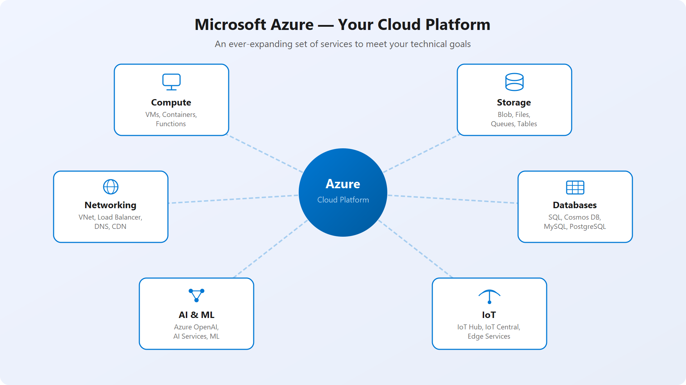

## **What is cloud computing?**
Delivery of computing services over the internet.
 

| Azure Services | Why use them? |
|---|---|
| VMs |  
| Storage |  
| Databases |  **To expand capabilities you do not need in your physical space** |
| Networking |  
| Internet of Things (IoT) |  
| Machine Learning |  
| AI |  

 
 
* At a basic level, cloud computing makes it much easier and faster to get the resources you need. Instead of buying hardware, waiting for it to arrive, and setting everything up, you can create resources when you need them and adjust them as your needs change.
 
 
 
* Cloud services are also available around the world, so you can run services closer to your users and use multiple regions for better reliability without having to build and maintain your own datacenters.
 
 
 
 

 
* **You will always be more responsible for what STAYS with You.**
 
 

## <ins>Things that YOU are responsible for:</ins>

* **Data**            →  Information stored in cloud
* **Access Security** → only give access to those who NEED it
* **SQL**            → you must patch and update
  
 
 

## <ins>Things that the PROVIDER is responsible for:</ins>

* **Physical Security** →   Keycard or other physical barriers
* **Power**               → Supply of steady electricity and Cooling
* **Network Connectivity** → Build and maintain their own network gear, patches and routing
* **SQL** → They maintain the ACTUAL Database host

 

---
---
 
 
 
 

# **Different types of Clouds**

 

## **Private Cloud**
**Dedicated to the ONE ORG**
* **A private cloud is a dedicated computing environment used exclusively by a single organization**, such as a bank's internal server network, a hospital's secure patient data system, or a company's private VMware infrastructure.

##
* Complete control over resources and security.
* Data NOT collocated with other tenants.
* Hosted on-premises or in dedicated Datacenter.
* Greater Cost, fewer benefits of the Public Cloud.
* Natural evolution from tradtional Datacenter.
  
##

* **MANAGED BY:** You or Third Party.
* **SINGLE ORG**
---
 

## **Public Cloud**
**Provider infrastructure**
* **A public cloud is a service run by a third-party company.** It lets many people and businesses share the same computer hardware over the internet.
* Popular examples include **Amazon Web Services (AWS), Microsoft Azure, Google Cloud Platform**, and consumer tools like **Gmail**.

## 
* No Capital expenditures (CAPEX) to scale UP
* Quick Provisioning and Deprovisioning.
* Pay ONLY for what you USE.
* Built, controlled and maintained by Provider.
## 
* **MANAGED BY:** Cloud provider.
* **GENERAL PUBLIC ACCESS**
---

 

## **Hybrid Cloud**
**Both Connected**
* **A classic hybrid cloud example** is an **e-commerce store.** The store keeps its **private customer database on its own secure, local computers (on-premises)**.
* During big shopping events like Black Friday, it uses extra computer power from a public cloud like Amazon Web Services to handle the heavy web traffic.

##
* Provides the MOST FLEXIBILIITY
* Control Security Compliance or Legal.
* Surge to Public Cloud for temporary demand.
* Extra layer of Security between environments.
* EXTRA layer of security
##
*  **Managed by:** You and Provider.
*  **Private and Public interconnected.**
---

 

## **Multi-Cloud**
**Multiple Providers**

* A **multi-cloud setup** means a company uses public cloud services from **two or more** different vendors—such as **Amazon Web Services (AWS), Google Cloud Platform (GCP), and Microsoft Azure** at the same time.
*  For example, a global online store might run its main website on AWS, use Google Cloud for data analytics and artificial intelligence, and host user identity databases on Microsoft Azure

##
* Multiple public cloud providers.
* Different Features from Different Providers.
* Manage Resources and security across environments.
* Increasingly common deployment scenarios.
* Supports provider migrations scenarios.
##
*  **Managed by:** You and Provider.
*  **2 or More providers connected.**
---

 
